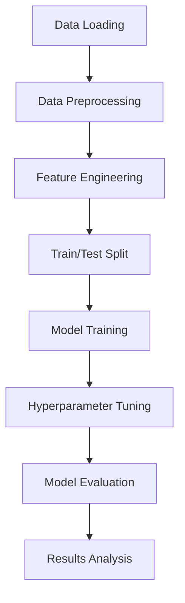

# Phishing Website Detection - Machine Learning Pipeline

## a. Candidate Information
- **Full Name**: Zhao Chenanxin
- **Email Address**: chelseazhao233@gmail.com

## b. Project Overview
This project implements an end-to-end machine learning pipeline for detecting phishing websites using various technical and categorical features extracted from website characteristics.

### Folder Structure
```
aiap22-Zhao-Chenanxin-588Z/
├── src/
│   ├── dataloader.py      # Data acquisition from SQLite database
│   ├── preprocess.py      # Data cleaning and validation
│   ├── feature_engineering.py # Feature transformation and encoding
│   ├── model.py           # Model training and hyperparameter tuning
│   ├── evaluate.py        # Model evaluation and analysis
│   └── main.py           # Pipeline orchestration
├── data/                  # Database storage 
├── eda.ipynb            # Exploratory Data Analysis
├── requirements.txt     # Python dependencies
├── run.sh              # Execution script
└── README.md           # This file
```

## c. Execution Instructions

### Prerequisites
```bash
# Install dependencies
pip install -r requirements.txt
```

### Running the Pipeline
```bash
# Method 1: Using the bash script
./run.sh

# Method 2: Direct execution
python src/main.py 
#or 
python3 src/main.py  
```

### Modifying Parameters
Key parameters can be modified in `src/main.py`:
```python

# Data splitting ratio
test_size = 0.2

```

## d. Pipeline Flow



**Logical Steps:**
1. **Data Acquisition**: Download and load data from SQLite database
2. **Preprocessing**: Handle missing values, outliers, and data validation
3. **Feature Engineering**: Scale numerical features, encode categorical variables
4. **Model Training**: Train multiple algorithms with cross-validation
5. **Hyperparameter Tuning**: Optimize model parameters using GridSearch
6. **Evaluation**: Comprehensive performance assessment on test set
7. **Analysis**: Feature importance and model interpretation

## e. Key EDA Findings & Pipeline Choices

### Summary of EDA Insights:
- **Domain Age**: Strongest predictor - legitimate sites are significantly older (39 vs 8 months median)
- **Technical Sophistication**: Legitimate sites show more complexity (code, images, iframes)
- **Infrastructure Patterns**: Free hosting providers strongly associated with phishing
- **Website Quality**: Responsive design and robots.txt indicate legitimacy

### Pipeline Decisions Based on EDA:
1. **Feature Selection**: Used all available features as each provided unique signals
2. **Preprocess**: Properly processed the data based on the outliers/missing data found in EDA
3. **Final Model Choices**: Given these data-driven considerations, the following three models were selected:

    1) Logistic Regression (Baseline, Interpretable)

            **Why?**
            - Provides a clear, explainable baseline
            - Coefficients allow straightforward interpretation of feature effects
            - Useful for validating trends observed in EDA

            **Limitations:**
            - Assumes linearity
            - Not robust to skew/outliers
            - May underperform compared to non-linear models

    2) Random Forest Classifier (Robust Baseline Tree Model)

            **Why?**
            - Handles extreme skew and outliers without preprocessing
            - Captures non-linear feature relationships
            - Easily interpretable through feature importances
            - Works well on mixed numerical + categorical data

            **Strength:**
            - Very stable, low risk of overfitting due to ensembling
            - Good benchmark tree-based model

    3) XGBoost / Gradient Boosting Classifier (High-Performance Model)

            **Why?**
            - Best suited for datasets with skewed, noisy, and high-variance features
            - Learns complex interactions between numeric and categorical variables
            - Typically achieves state-of-the-art performance on tabular classification
            - Provides SHAP values for detailed interpretability
            
            **Strength:**
            Handles subtle patterns such as:
            - "Low Domain Age + Free Hosting Provider = high phishing probability"
            - "Large number of images but site responsive = legitimate"


## f. Feature Processing Summary

| Feature Type | Features | Processing Method | Reason |
|-------------|----------|-------------------|---------|
| Numerical | LineOfCode, DomainAgeMonths, etc. | StandardScaler | Normalize different scales |
| Categorical | HostingProvider, Industry | OneHotEncoder | Convert to numerical format |
| Binary | Robots, IsResponsive | Passthrough | Already in 0/1 format |
| Target | label | No processing | Binary classification |

**Total Features**: 14 original features → ~34+ processed features after encoding

## g. Model Selection Justification

### Random Forest
- **Why**: Handles mixed data types well, robust to outliers, provides feature importance
- **Hyperparameters**: n_estimators, max_depth, min_samples_split

### Logistic Regression
- **Why**: Simple baseline, interpretable coefficients, fast training
- **Hyperparameters**: C, penalty, solver

### Gradient Boosting
- **Why**: State-of-the-art performance, handles complex relationships
- **Hyperparameters**: n_estimators, learning_rate, max_depth

**Rationale**: Diverse model family covering different learning approaches (ensemble, linear, boosting) for comprehensive comparison.

## h. Model Evaluation

### Evaluation Metrics:
- **Accuracy**: Overall correctness rate
- **Precision**: Proportion of true positives among predicted positives (avoid false alarms)
- **Recall**: Proportion of actual positives correctly identified (catch phishing sites)
- **F1-Score**: Harmonic mean of precision and recall (balanced metric)
- **ROC-AUC**: Model's ability to distinguish between classes

### Expected Performance:
Based on cross-validation, models achieve:
- **F1-Scores**: 0.80-0.87 range
- **Accuracy**: 78-85% on test set
- **Key Finding**: Random Forest and Gradient Boosting perform similarly well but Gradient Boosting is slightly better.

### Model Selection:
- **Primary Metric**: F1-score (balances precision and recall)
- **Secondary Metric**: ROC-AUC (class separation ability)
- **Final Selection**: F1-score (In phishing detection, F1 score is prioritized over ROC-AUC because it directly addresses the critical business trade-off between false positives (legitimate sites incorrectly blocked, causing user frustration) and false negatives (missed phishing sites, creating security risks). While ROC-AUC measures overall class separation ability, F1 score specifically balances precision and recall, ensuring the model neither overwhelms users with false alarms nor misses dangerous phishing attempts - both of which have significant real-world consequences in cybersecurity applications where both error types carry substantial costs.)


## Conclusion
This pipeline demonstrates a robust approach to phishing detection using machine learning, with careful attention to data quality, model selection, and evaluation methodology. The modular design allows for easy maintenance and extension as new features or models become available.
```

This README provides comprehensive documentation covering all required aspects while maintaining professional clarity and technical depth appropriate for the AIAP assessment.


